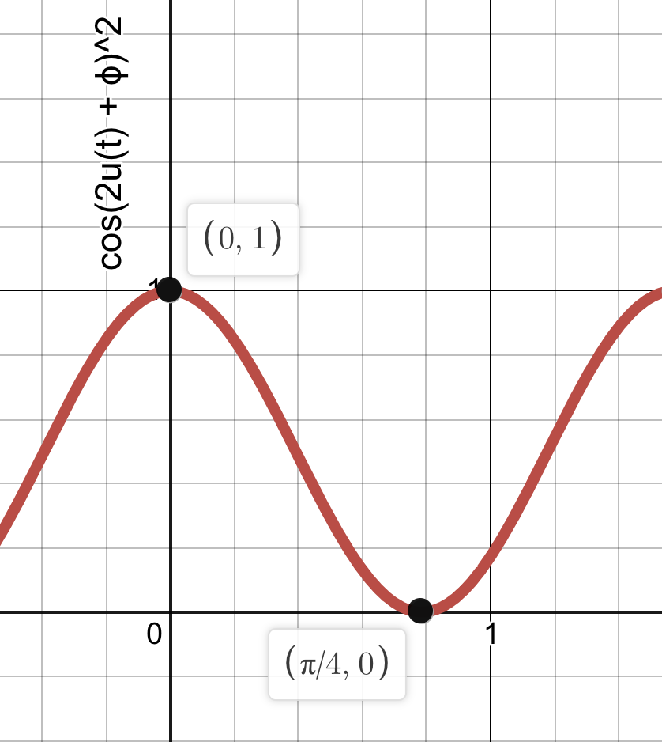

# laser-control

## Goal

We want to stabilize the power output of the TiSapph beam. We can control the effective power of the beam using a waveplate and a polarizing beamsplitter cube. By manually rotating this waveplate, we can rotate the polarization of the light, which then influences how much of the light is transmitted versus reflected once reaching the cube. The light which is transmitted is to be used throughout the rest of the optics table, while the reflected light is sent to a beam dump. The problem is that the power output of the laser varies a lot over time, meaning that the waveplate must be manually adjusted often. Our goal is to automate the adjustment of the waveplate by using a motorized rotation mount that can be controlled by a computer, such as a Red Pitaya.

## Materials

1. Red Pitaya (rp-f056a7)
2. Thorlabs ELL14 Rotation Mount with interface board
3. Half-waveplate
4. Polarizing beam splitter cube
5. Photo detector

## Feeback loop

The idea is to stabilize the power of the beam using a PID controller, modeled below. We will measure the power of the transmitted laser light using a photo detector, whose voltage output y(t) is measured by the Red Pitaya. This is then compared to a setpoint voltage r(t), which is a constant voltage value determined by the desired power output of the beam. Their difference e(t) = r(t) - y(t) is called the error.

The role of the PID controller is to take this error e(t) and produce a control signal u(t). This control signal is an instruction to the "plant or process" which has influence over the current measured voltage y(t) from the photo detector. In our case, the "plant or process" is the rotation mount and u(t) is the angle by which to rotate it in order to correct y(t) so that it is closer to the desired setpoint voltage r(t). This process is repeated over and over again:

1. Measure the error e(t) = r(t) - y(t) in the voltage from the photo detector
2. Pass e(t) into the PID controller, which outputs u(t)
3. Rotate the rotation mount by u(t) radians, which changes y(t)
4. GOTO step 1

## How the control signal is calculated

Given the error signal e(t), the produced control signal u(t) depends on a Proportional, Integral, and a Derivative term, hence the term PID controller. These terms are each weighted by a certain value so you can tune how much they influence the corrective action. Formally, u(t) is given by

where Kp, Ki, Kd are non-negative constants which can be tuned as desired.

The first term, directly proportional to the error, is the simplest to understand. The larger the present error is, the larger our corrective action will be.

The second term, the integral of the error from t = 0 to the present, accounts for accumulation of past error. It is a measure of the area underneath the graph of e(t), and will continue to grow, increasing the corrective action, even when the proportional term is small.

The third term, the derivative of the error, accounts for future "predictions" of the error. If the error is increasing rapidly, this term can anticipate the impending increase in error and take corrective action.

## Thinking of u(t) as an angle

We are using u(t) directly as the angle by which to rotate the waveplate. This means that the polarization of the beam will be rotated by 2u(t), and thus the power of the transmitted light will be proportional to cos(2u(t) + ϕ)2 for some arbitrary offset angle ϕ. For typical PID scenarios, y(t) is somehow linearly related to the control signal u(t) (for example, the RPM of a motor is proportional to the current supplied to the motor). However, in this case we see that y(t) oscillates with u(t). This can lead to problems for large enough values of Kp, Ki, and Kd.

For example, let's say the measured voltage is too low and thus e(t) is negative. Assume Kp = 1, Ki = 0, and Kd = 0. Therefore, u(t) is negative, which indicates a clockwise rotation of the waveplate. The PID controller expects this action to increase the voltage output. However, an arbitrary clockwise rotation may increase or decrease the power of the laser! If it increases the power, e(t) will get even more negative, signaling a larger clockwise direction. This sounds bad. Eventually, however, the waveplate will rotate far enough clockwise that it starts bringing the power down again. This will bring e(t) closer and closer to zero as the voltage approaches its setpoint. If it passes the setpoint by a little, e(t) will be a small positive number, causing a small counter-clockwise rotation. This time, we know that this is the right direction of rotation because we are "stuck on a hump" of the graph of cos(2u(t) + ϕ)^2.

We always want to try and choose low enough Kp, Ki, and Kd so that we get "stuck on a hump" of cos(2u(t) + ϕ)^2. If we choose values that are too large, u(t) may be such a large rotation that we miss such a hump and never converge on the setpoint. Specifically, we want the magnitude of u(t) to be less than or equal to π/4, which is half the period of cos(2u(t) + ϕ)^2.

## Operation

1. Prepare optics components: Laser >> rotation mount >> beam splitter >> photo detector.
2. Plug the Red Pitaya (rp-f056a7) into the lab's local network and connect the power supply.
3. Connect rotation mount to interface board, then connect power supply to interface board, then connect interface board to Red Pitaya using a micro USB to USB type A cable.
4. Connect photo detector to power supply, then use a BNC cable to connect it to the first SMA analog input of the Red Pitaya using an SMA to BNC adapter. Turn on the photo detector. You now have everything connected!
5. Go to ​`http://rp-f056a7.local/` on any computer connected to the lab's local network.
6. Click "Python Programming", which will open a jupyter notebook. Next, File >> Open >> `laser_pid.ipynb`.

Follow the instructions in the python notebook.

The PID loop is also available as a raw python file in the root directory of the Red Pitaya for more straightforward execution.
